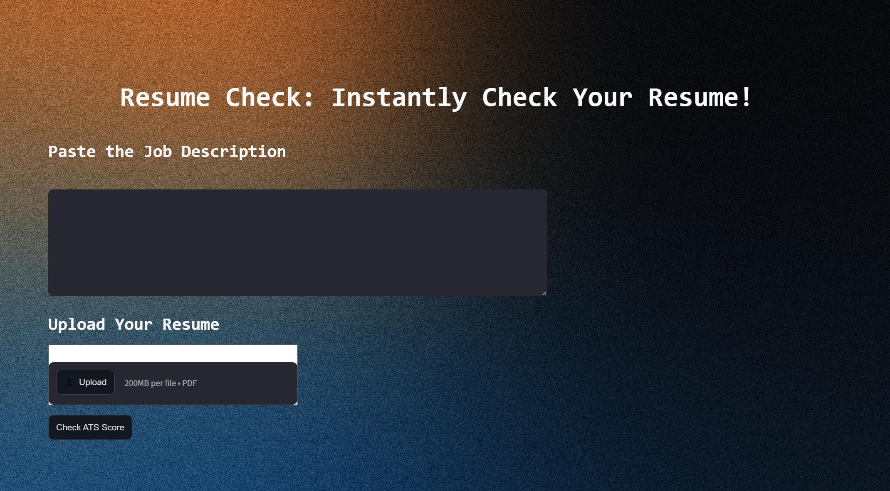
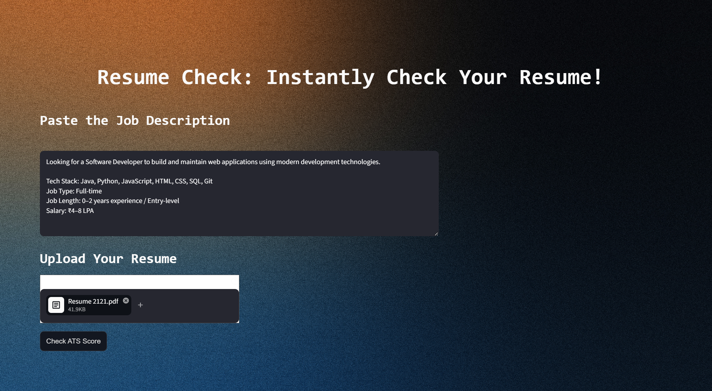
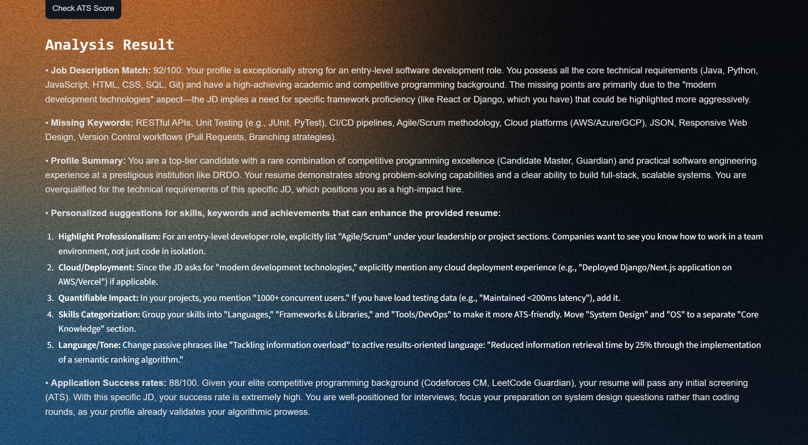

# Resume Check

## About The Project





**Resume Check** is an AI-powered ATS that analyzes resumes against job descriptions. It uses **Google Generative AI** and **PyPDF2** to provide match scores, missing keywords, profile summaries, and personalized resume improvement suggestions through a **Streamlit** interface.

## Built With

- Streamlit
- PyPDF2
- Google Generative AI
- Python-dotenv

## Getting Started

This section provides instructions on setting up your project locally. Follow these steps to get a local copy up and running:

### Installation Steps

**Option 1: Installation from GitHub**

1. **Clone the Repository**

   ```bash
   git clone https://github.com/shubhangi177/ats-resume-checker.git
   ```

2. **Install Dependencies**

   ```bash
   pip install -r requirements.txt
   ```

3. **API Key Setup**
   To use this project, you need an API key from Google Gemini Large Language Model.

   **Set Up API Key:**
   Create a file named .env in the project root.
   Add your API key to the .env file:

   ```bash
   GOOGLE_API_KEY=your_api_key_here
   Note: Keep your API key confidential. Do not share it publicly or expose it in your code.
   ```
